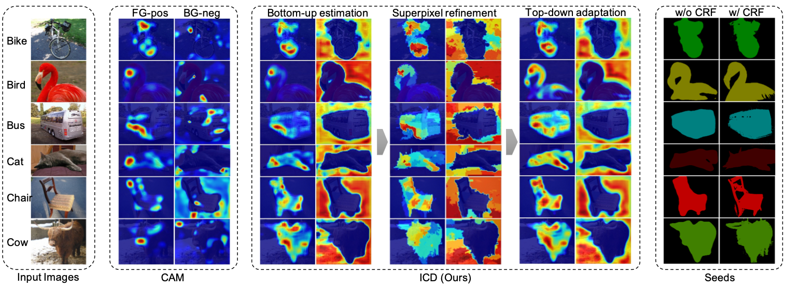

# Learning Integral Objects with Intra-Class Discriminator for Weakly-Supervised Semantic Segmentation
Learning Integral Objects with Intra-Class Discriminator for Weakly-Supervised Semantic Segmentation, Junsong Fan, Zhaoxiang Zhang, Chunfeng Song, Tieniu Tan, CVPR2020 [[paper]](http://openaccess.thecvf.com/content_CVPR_2020/papers/Fan_Learning_Integral_Objects_With_Intra-Class_Discriminator_for_Weakly-Supervised_Semantic_Segmentation_CVPR_2020_paper.pdf).


## Introduction

The previous class activation map (CAM) based approach learns inter-class boundaries, which focus on the difference between different foreground classes. It may not be optimal for the weakly supervised segmentation problem because the target object and the background share the same classes in the same image. To alleviate this problem, we propose an ICD approach to learning per-category intra-class boundaries between the foreground objects and the background, which is more appropriate for weakly supervised segmentation problems.


The proposed approach is end-to-end and can be trained together with the CAM branch in a single round. The pseudo-masks derived by the proposed ICD is more complete than the CAM based results.





## Citation

```
@InProceedings{Fan_2020_CVPR,
author = {Fan, Junsong and Zhang, Zhaoxiang and Song, Chunfeng and Tan, Tieniu},
title = {Learning Integral Objects With Intra-Class Discriminator for Weakly-Supervised Semantic Segmentation},
booktitle = {IEEE/CVF Conference on Computer Vision and Pattern Recognition (CVPR)},
month = {June},
year = {2020}
}
```

